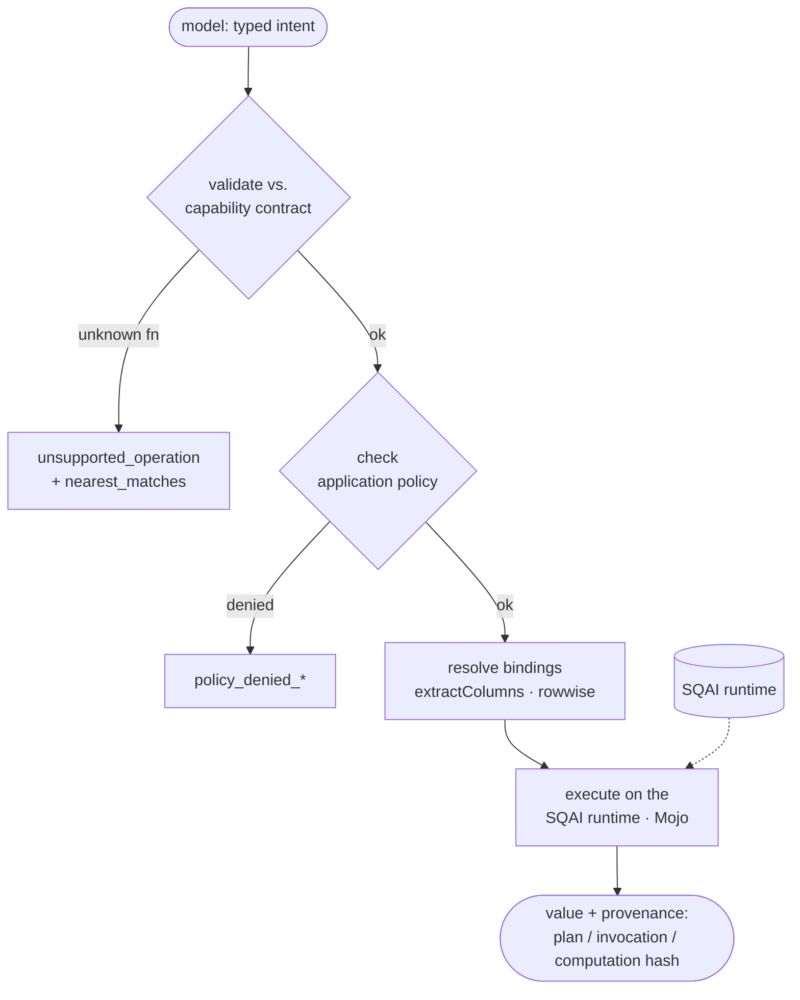

# How it works

SQAI (Structured Query AI) splits one idea in two: **the model proposes meaning; SQAI controls execution.** The calling model authors a typed request — a metric to aggregate, or a named function to run over source columns — and SQAI turns it into a plan it can validate, authorize, execute, and hash. The model never writes SQL, never emits code to `eval`, and never touches a write path. Every operation it can reach is read-only by construction.

This page traces a request from typed intent to the returned value and its provenance: the pipeline, the two execution planes, the discovery loop a model uses to find its footing, and why the same request produces byte-identical hashes in TypeScript and Python.


New to SQAI? Start with the [TypeScript quickstart](quickstart-ts.md) or the [Python quickstart](quickstart-python.md) — connect a source and get a hashed answer in a few lines. This page is the mental model behind them.


## The model proposes, SQAI disposes

SQAI never lets the model author execution — it chooses from a fixed, read-only surface, and SQAI decides whether and how each choice runs.

| | Raw-SQL / code tools | SQAI |
|---|---|---|
| What the model authors | A SQL string or free-form code | Typed intent, validated against a contract |
| Execution surface | Anything the connection allows | 5,790 exposed read-only capabilities |
| Write path | Present unless you block it | None — read-only by construction |
| Governance | Prompt-level, best-effort | Code-level allow-lists the model can't widen |
| Reproducibility | None guaranteed | Every result carries a replay hash |

SQAI reimplements nothing. It validates intent, authorizes it against policy, resolves bindings, and hashes — the arithmetic belongs to the SQAI runtime. Every result and provenance field passes through verbatim; a numeric discrepancy is fixed upstream in the SQAI runtime, never patched here.

## The pipeline

Every request — from `ask()`, `compute()`, or an AI SDK tool — runs the same gauntlet. Only the last two stages touch the SQAI runtime.



#### Typed intent in

The model emits a typed object, not a string. A query intent is a `QuerySpec` (`metric`, optional `aggregation`, `group_by`, `filter`, `limit`, `order`); a computation intent is a `ComputationSpec` (`module`, `function`, `args`/`kwargs`/`bindings`, optional `seed`). The [AI SDK tools](ai-sdk-tools.md) expose exactly these two shapes as a discriminated union — no SQL surface, no code surface to author.


#### Validate against the hash-pinned capability contract

The intent is checked against the **capability contract** — one generated, hash-pinned file (`contract_hash = sha256:31247fb2…`) listing every operation, its signature, and its determinism flags. A capability is reachable only if `read_only && (deterministic || deterministic_when_seeded)`; anything non-deterministic or write-capable is not in the exposed surface at all. An unknown function fails `unsupported_operation` and returns `nearest_matches` from the same index.


#### Check application policy

The application's allow-lists (`allowedSources`, `allowedFields`, `allowedFunctions`) are enforced here — on the source, on every metric/group/filter/bound column, and on the function name. A denial is `policy_denied_source` / `policy_denied_field` / `policy_denied_function`. Policy is set only in `createSQAI()`, can only **narrow** the contract, and is unreachable from model tool input.


#### Resolve row-aligned bindings

Computation bindings reference source columns by name; SQAI pulls the actual values through the runtime's aligned `extractColumns` primitive (`nullPolicy` default `pairwise`, `alignment: "rowwise"`). SQAI never zips arrays itself — the runtime owns column alignment so the hashed input matches what actually executes. Every signature parameter is supplied through **exactly one** of positional `args`, named `kwargs`, or `bindings`; a collision is `duplicate_argument_binding`.


#### Execute on the SQAI runtime

Only now does the request reach the SQAI runtime — the signed Mojo runtime, dispatched locally on your own machine, or to a private SQAI deployment depending on mode. The runtime is pinned single-threaded at `float64` precision, so a computation is reproducible within its declared scope.


#### Result + provenance out

The result comes back self-describing. Queries carry `plan_hash`, `decision_path`, and `validated`; computations carry `invocation_hash`, `computation_hash`, `contract_hash`, and a full determinism envelope. See [Determinism & provenance](determinism.md) for how each hash is built.



## The two planes

SQAI exposes structured data through two planes. They share the contract, the policy layer, and the provenance vocabulary; they differ in what they run and what they need to run it.



**In-process. No runtime process, no key.** Sub-millisecond on typical files.

Connect a CSV path, a SQLite file, or an array of records; then resolve typed metric/group/filter intent to a validated plan and execute it. Five aggregations: `sum`, `avg`, `count`, `min`, `max`. `ask()` returns exactly one of `ok`, `needs_clarification`, or `rejected` — it never guesses a column.

```ts
const source = await sqai.connect("./data/sales.csv", { name: "sales" });
// source.typed_fields → each field typed for the model:
```

```json
{
  "name": "sales",
  "fields": ["region", "product", "revenue", "cost", "units", "order_date"],
  "typed_fields": [
    { "name": "region", "type": "string" },
    { "name": "revenue", "type": "number" },
    { "name": "order_date", "type": "date" }
  ],
  "row_count": 12,
  "schema_revision": "e4938027ddf0d2210f019770403efd45d350eac28100902ddd7c5191c9b8cfbe",
  "status": "ready"
}
```

Connected sources are immutable — re-connecting a name with a changed `schema_revision` throws `source_already_registered`. The query plane runs entirely in `createSQAI()`'s process; it needs no runtime. Local compute access uses the free `sqai_developer` device key from `sqai login`.


**Managed runtime. Provisioned once, then warm.**

Dispatch any of the **5,790** read-only capabilities exposed to the SDKs (of **6,084** in the contract; **5,780** deterministic plus **10** seed-required simulations). The signed Mojo runtime downloads, verifies (RS256 + sha256), extracts, and initializes on the **first-ever** `compute()` call — a one-time provision of ~110s. After that it stays resident: **no per-query cold start.** Every later `compute()` is warm — `finance.npv` measured at 0.83–0.93 ms.

```ts
const result = await sqai.compute({
  module: "finance",
  function: "npv",
  args: [0.1],
  bindings: [{ parameter: "cashflows", source: "sales", field: "revenue" }],
});
```

Simulations require a `seed` (`seed_required`) so every run is replayable. See [Compute & filtering](compute-and-filtering.md) for the full `ComputationSpec`.




**Read-only by construction.** The two planes are not interchangeable, and neither can write. The query plane is a metric-aggregation surface over your sources; the computation plane is a function-dispatch surface over the runtime's math library. Non-deterministic and write categories are never generated into the exposed surface — no flag, policy, or model input turns them back on.


## The discovery loop

A model doesn't guess field names or function signatures — it discovers them, then dry-runs before it spends an execution. The three [AI SDK tools](ai-sdk-tools.md) are built for exactly this loop.



#### `listSources()` — what can I touch?

No arguments: connected sources with exact field names, types, and the allowed operations per field. Call this before `queryData` so specs use exact names.


#### `listSources({ capabilitySearch })` / `listSources({ module })` — what can I compute?

`capabilitySearch: "npv"` searches the deterministic catalog and returns matching modules; `module: "finance"` lists that module's functions with exact signatures and `seed_required`.


#### `explainQuery({ … })` — will it run?

Dry-run without executing. A query returns `resolved_plan`, `plan`, `plan_hash`, `confidence`, and `validated`; a computation returns the `matched_signature`, a preview `invocation_hash`, and whether a seed is required. Debug clarifications and rejections here.


#### `queryData({ … })` — run it.

Execute one query or computation intent. Returns the result plus full provenance. Large results are truncated for context and stay retrievable by `result_id`.



## The resolved plan, concretely

`ask({ metric: "revenue", aggregation: "sum", group_by: "region", source_name: "sales" })` resolves to an exact column, executes, and returns the plan it ran — no ambiguity, no model in the loop:

```json
{
  "status": "ok",
  "data": {
    "query_id": "local_query_f87610d8afeb",
    "result": [
      { "region": "east",  "revenue": 2130.5, "count": 5 },
      { "region": "west",  "revenue": 1519,   "count": 4 },
      { "region": "north", "revenue": 1000,   "count": 3 }
    ],
    "plan": [
      "Use source 'sales'.",
      "Aggregate 'revenue' with 'sum'.",
      "Group by 'region'."
    ],
    "resolved_column": "revenue",
    "resolved_role": "measure",
    "resolved_source": "sales",
    "ambiguous": false,
    "exact_spec": true,
    "decision_path": "exact_spec",
    "plan_hash": "f87610d8afeb13e17500df6d275725825780c1f9f3d2eab54387de528d255aa7",
    "schema_revision": "e4938027ddf0d2210f019770403efd45d350eac28100902ddd7c5191c9b8cfbe",
    "validated": true,
    "deterministic_scope": "local_registered_source",
    "confidence_source": "local_exact_execution"
  }
}
```

`decision_path: "exact_spec"` means the spec named the column and source exactly — the resolver scored one candidate at confidence `1` and executed. When a metric is ambiguous, `ask()` returns `needs_clarification` with the candidates instead of guessing.

## Bindings, not inline data

A model never pastes a column of numbers into a tool call. It names a source and its fields; SQAI resolves the actual values in-process, keeps large data out of the model's context, and makes the hash honest — `input_hash` is computed over the values the runtime actually received. The result carries the binding provenance:

```json
{
  "status": "ok",
  "value": 3188.1687606249325,
  "module": "finance",
  "function": "npv",
  "invocation_hash": "8223a694250fc751fcf8a7777b8e1f524c44ff1f0e7e83451467f554a6123950",
  "computation_hash": "ff5280ea128113f528dd1e9a28b9bc4a81469075ed7c981c7176fb172d98085d",
  "contract_hash": "sha256:31247fb219e656f349bb6d36fa65c2e2702e2688a2fddb4b16f1a9e09a02cdbb",
  "provenance": {
    "bindings": [
      {
        "source_name": "sales",
        "fields": ["revenue"],
        "schema_revision": "e4938027ddf0d2210f019770403efd45d350eac28100902ddd7c5191c9b8cfbe",
        "row_count": 12,
        "input_hash": "2ea5ede72acd2912fe9e1230cef34afad4c9436bfa8a709bac2da02b478e3212"
      }
    ]
  },
  "latency_ms": 0.83
}
```

## Provenance and replay

Every compute result is self-describing — the hashes below plus the exact scope it ran in, so a replay asserts like-for-like.

| Field | Plane | Known | Covers |
|---|---|---|---|
| `plan_hash` | query | after resolve | the canonical, null-stripped resolved plan |
| `invocation_hash` | compute | **before** execution | module, function, args, resolved bindings, seed, contract, scope |
| `computation_hash` | compute | **after** execution | `invocation_hash` folded with the canonical result |
| `contract_hash` | compute | always | the pinned contract the hashes were computed against |

Each compute result also carries a determinism envelope — `runtime_bundle_version`, `runtime_bundle_sha256`, `platform`, `architecture`, `kernel_build` (`mojo`), `precision_mode` (`float64`), `thread_count` (`1`), `seed?`, `input_hash`. Same input, same envelope, same hash — every time:

```json
{
  "run1": "b74f67d0d7a594aa7ac91f6291612452aa8ccdf603351ebc8d801a6fddd91bc8",
  "run2": "b74f67d0d7a594aa7ac91f6291612452aa8ccdf603351ebc8d801a6fddd91bc8",
  "identical": true
}
```

Results too large to hand a model are truncated to a preview and stored: `getResult(result_id)` returns the full value by a random, tenant-authorized, TTL-bounded id. A wrong-tenant lookup is indistinguishable from a miss (`result_not_found`). See [Determinism & provenance](determinism.md).

## One request, one hash — in both languages

The TypeScript and Python SDKs share one canonical serializer (conformance-locked: −0 normalization, ECMAScript number rendering, sorted keys, stable binding order). The consequence: the same logical computation yields **byte-identical** hashes whether it ran in Node or CPython. `finance.npv(0.1, [-1000, 300, 420, 560, 680])` in **both** SDKs:

```json
{
  "value": 505.020148896933,
  "invocation_hash": "b3ca3e925e4372a5f9365790a29c486afed868073d3fd301d03022f44689e423",
  "computation_hash": "b74f67d0d7a594aa7ac91f6291612452aa8ccdf603351ebc8d801a6fddd91bc8"
}
```

A result computed in one language replays and verifies in the other.

## Connectors

The query plane connects to files and SQLite **in-process** (no key, no cloud — nothing leaves your machine); live databases connect through a private SQAI deployment (`SQAI_DEPLOYMENT_URL`) on your own infrastructure. No data is copied; credentials are encrypted and access is governed.

| Where it runs | Env | Connectors |
|---|---|---|
| In-process (local) | _(none)_ | CSV, TSV, JSON, in-memory row arrays, `{records:[…]}`, SQLite file; Excel + Parquet (Python) |
| Private SQAI deployment | `SQAI_DEPLOYMENT_URL` | PostgreSQL, MySQL, **Oracle**, SQL Server, Snowflake, BigQuery, ClickHouse, Redshift; S3 / GCS / Azure Blob; Redis / Neo4j / Elasticsearch; REST; GitHub / GitLab / Bitbucket |

## Modes

SQAI has **no cloud**. The same code runs in two modes, and SQAI infers the mode from the environment: no env vars ⇒ `local`; `SQAI_DEPLOYMENT_URL` set ⇒ `deployment`. `SQAI_API_KEY`, if set, is *only* the Bearer credential forwarded to a private SQAI deployment when it requires auth — it never selects a cloud and does not change the mode.

| Env | Mode | Query plane | Computation plane |
|---|---|---|---|
| _(none)_ | `local` | in-process | on-device runtime, provisioned transparently — stays local |
| `SQAI_DEPLOYMENT_URL` | `deployment` | in-process | POST `{deploymentUrl}/v1/libraries/execute` (your SQAI deployment) |

Keep SQAI imports server-side; on Next.js set `export const runtime = "nodejs"` (the Node runtime, not Edge).

## Data flow




`@thyn-ai/sqai/unsafe` exposes `getUnsafeRuntime()`, which bypasses the contract, policy allow-lists, seed enforcement, and cross-language parity. It is never bundled into the AI SDK and is never reachable by a model. Use it only in code you fully own — outside the contract, none of the guarantees on this page apply.


## Next steps

- [Compute & filtering](compute-and-filtering.md) — the full `ComputationSpec`, argument assembly, and simulations.
- [Determinism & provenance](determinism.md) — the three hashes and the determinism envelope, field by field.
- [Policy & governance](policy.md) — allow-lists, enforcement points, and the narrow-only rule.
- [Vercel AI SDK tools](ai-sdk-tools.md) — the four tools that expose this pipeline to a model.
