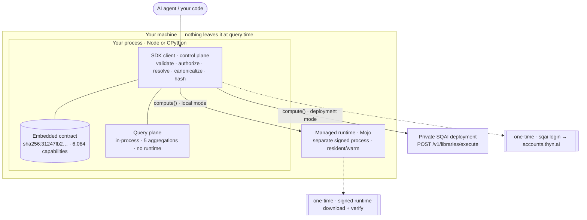

# Architecture

[How it works](../concepts.md) traces one request from typed intent to a hashed result. This page is the other axis: **what SQAI is made of, and where the lines are drawn between the pieces.** SQAI is a thin *control plane* — an in-process SDK that validates, authorizes, resolves, and hashes — sitting over an *execution plane* it does not implement: a query engine for your sources and a signed runtime for the math. The control plane owns every guarantee on this page; the execution plane owns every number.

The whole system runs on one machine. There is **no SQAI cloud**. The only network calls SQAI ever makes are a one-time free device login for licensing and a one-time signed-runtime download — never your data, never at query time. Everything else — validation, policy, binding resolution, canonical hashing, and the entire query plane — happens in your own process.


Start with the [TypeScript](../quickstart-ts.md) or [Python quickstart](../quickstart-python.md) to see the surface in action, then read [How it works](../concepts.md) for the request pipeline. This page assumes both and zooms out to the components and their trust boundaries.


## Control plane vs. execution plane

SQAI's central design move is a split between deciding and doing. The SDK client is a **control plane**: given a typed intent it validates the operation against a contract, enforces your policy, resolves any bindings to real column values, canonicalizes the identity, and computes the provenance hashes — all in-process, all before anything runs. It then hands the vetted operation to an **execution plane** that reimplements none of SQAI's logic: the query plane aggregates your source, and the managed runtime evaluates the capability. Results and every provenance field the runtime emits pass back through verbatim.

The consequence is that the security-critical code is small, in your process, and the same in both languages, while the numerics live in a signed, versioned artifact that can be replaced without touching a guarantee.



## The packages

SQAI ships as a small family that composes around one core. The core carries the contract and the provisioner; the AI SDK and CLI are thin wrappers over it. The TypeScript and Python cores are two implementations of one specification — same method set, same result shapes, and the same canonical serializer, so their hashes are byte-identical.

| Package | Language | What it adds |
|---|---|---|
| `@thyn-ai/sqai` | TypeScript | Core SDK — `createSQAI`, the embedded hash-pinned contract, the on-device runtime provisioner, `SqaiValue` / `SqaiError` types. |
| `@thyn-ai/sqai-ai-sdk` | TypeScript | The three Vercel AI SDK tools (`listSources`, `explainQuery`, `queryData`) that expose the pipeline to a model. |
| `@thyn-ai/sqai-cli` | TypeScript | `sqai login`, `doctor`, `runtime install`, and the rest of the CLI surface. |
| `sqai` | Python | `create_sqai` / `SQAI`, snake_case methods, dict results — byte-identical hashes to the TS core. |

All packages are at version 0.1.14. The core needs no separate service to start: files, records, and SQLite run entirely in-process, and `compute()` provisions its runtime transparently on first use.


`@thyn-ai/sqai/unsafe` (`getUnsafeRuntime`) / `sqai.unsafe` (`get_unsafe_runtime`) returns the raw runtime with **none** of the guarantees below — it bypasses the contract, policy allow-lists, seed enforcement, and cross-language parity. It is deliberately kept out of the package root and out of the AI SDK, and is never reachable by a model. Import it only in code you fully own.


## The SDK client, layer by layer

The client returned by `createSQAI()` / `create_sqai()` is where governance lives. Every method walks the same layers before dispatch; each layer is a strict gate, and the runtime is reached only after all of them pass.



#### Contract validation

The intent is checked against the embedded capability contract: the operation must exist, its arguments must match the signature, and it must be `read_only && (deterministic || deterministic_when_seeded)`. Unknown functions fail `unsupported_operation` with `nearest_matches`. This layer reads only the in-process contract — no runtime, no key.


#### Policy enforcement

The application allow-lists (`allowedSources`, `allowedFields`, `allowedFunctions`) are applied to the source, every referenced column, and the function name. Policy is set only at construction, can only **narrow** the contract, and is unreachable from model tool input. Denials are `policy_denied_source` / `policy_denied_field` / `policy_denied_function`.


#### Binding resolution

Column bindings are pulled through the runtime's aligned extraction primitive (`nullPolicy` default `pairwise`, `alignment: "rowwise"`) — SQAI never zips arrays itself, so the hashed input matches what actually executes. Each parameter is supplied through exactly one of `args`, `kwargs`, or `bindings`; a collision is `duplicate_argument_binding`.


#### Canonicalization and hashing

The resolved identity is serialized with the shared canonical serializer and hashed into an `invocation_hash` **before** execution, then folded with the canonical result into a `computation_hash` **after**. The client computes provenance from the operation; it never logs it after the fact.



Beyond `connect`, `ask`/`resolve`/`query`/`verify`, `compute`, and `searchCapabilities`, the client exposes `getResult` / `get_result` for oversized outputs and a construction config of `policy`, `tenantId`, `timeout`, and `runtimeModules`. Every failure is a `SqaiError` with `code`, `message`, `retryable`, `source: "engine" | "sqai"`, `details`, and `requestId` / `request_id`; SQAI's own codes are non-retryable, and the runtime's codes pass through verbatim.

## The embedded contract

The contract is the architectural keystone — a single generated, hash-pinned file bundled inside every package. It lists **6,084 capabilities** across **445 modules**, each with its signature, category, and determinism flags, and it is the sole source of truth for both validation and hashing. Its identity is `contract_hash = sha256:31247fb2…`; that hash is folded into every `invocation_hash`, so a contract change moves every downstream hash by design.

| Slice | Count | Notes |
|---|---|---|
| Total capabilities | 6,084 | All `read_only`; **0** `write` capabilities exist. |
| Exposed to the SDKs | 5,790 | Reachable by `compute()`, `searchCapabilities`, and the AI SDK tools. |
| — deterministic | 5,780 | Replayable with no seed. |
| — seed-required simulations | 10 | `deterministic_when_seeded`; reject an unseeded call with `seed_required`. |
| Excluded | 204 | `non_deterministic` (still read-only) — never generated into the exposed surface. |

Determinism is a property of the surface, not a toggle: the 204 excluded capabilities are unreachable by any flag, policy, or model input. `searchCapabilities` reads this same embedded contract in-process, so a model can discover the exposed surface before it ever provisions a runtime. See [Compute & filtering](../compute-and-filtering.md) for the library grouped by domain.

## The two execution planes

The planes share the contract, the policy layer, and the provenance vocabulary; they differ in what they run and where the process boundary falls.



**In-process. No runtime, no key.** Connect a CSV/TSV/JSON path, an array of records, `{ records: [...] }`, or a SQLite file, then resolve typed metric/group/filter intent to a validated plan and execute it — all inside `createSQAI()`'s process. Five aggregations: `sum`, `avg`, `count`, `min`, `max`. `ask()` returns exactly one of `ok`, `needs_clarification`, or `rejected` and never guesses a column. A resolved query carries `plan_hash`, `schema_revision`, `decision_path`, and `validated`.

Sources are immutable — re-connecting a name whose `schema_revision` changed throws `source_already_registered`. Live databases are reached through a private SQAI deployment; nothing about the query plane depends on the runtime.


**A separate signed process.** Dispatch any of the 5,790 exposed capabilities. The client resolves and hashes in-process, then hands the vetted operation to the managed runtime (local) or to your private deployment. Results carry `invocation_hash`, `computation_hash`, `contract_hash`, and a full determinism envelope.

```ts
await sqai.compute({
  module: "finance",
  function: "npv",
  args: [0.1],
  bindings: [{ parameter: "cashflows", source: "sales", field: "revenue" }],
});
```

The runtime is where the crossing from your process to the execution artifact happens — and the only layer that ever needs the device license.




The planes are not interchangeable and neither can write. The query plane is a metric-aggregation surface over your sources; the computation plane is a function-dispatch surface over the runtime's math library. Read-only is structural, not configured.


## The managed runtime

The computation plane's execution artifact is a signed **Mojo** runtime that runs as its own on-device process — outside your interpreter, addressed over a local socket. It is provisioned once and then stays resident, so governance and dispatch add no per-query cold start. Its verified identity is stamped into every result's determinism envelope, so you can prove which signed artifact produced a value.



#### Provision on first use

The first-ever `compute()` downloads the bundle, verifies it, extracts it, and spawns the process — roughly **110s, once**. Disable the download in air-gapped setups with `SQAI_RUNTIME_AUTO_INSTALL=0`; compute then fails structured (`runtime_provision_failed`) and you install manually with `sqai runtime install`.


#### Verify before extract

RS256 signature (RSASSA-PKCS1-v1_5 + SHA-256, RSA-4096) over the exact manifest bytes → schema and path-safety checks → per-artifact sha256 and size → reject any unlisted, symlinked, or non-regular member — **all before extraction**. Then extract to a temp dir and atomic-rename. A rollback floor (`MIN_ACCEPTED_RUNTIME_VERSION = 0.1.0`) rejects downgraded manifests (`rollback_protected`); the downloaded manifest is never trusted to carry its own keys.


#### Stay warm and pinned

After provision the process stays resident. It is pinned single-threaded at `float64` precision — one fixed reduction order — which is what makes numbers reproducible. `finance.npv` measures `latency_ms` of 0.83–0.93 warm.



Bundles land in a per-user cache — macOS `~/Library/Caches/SQAI/runtime`, Linux `$XDG_CACHE_HOME/sqai/runtime`, Windows `%LOCALAPPDATA%\SQAI\runtime` — and the device license lives under `~/.sqai`. The trust root is embedded in the SQAI packages, so one release edit rotates the whole posture.

## Build-on-provision

The runtime you install need not carry all 445 modules. `runtimeModules` (env `SQAI_RUNTIME_MODULES`, comma-separated) filters the build to exactly the modules you call; the build service compiles and signs a bundle for that filter, cached by **filter-hash**.



#### Declare the filter

Pass `runtimeModules` to the client or set `SQAI_RUNTIME_MODULES`. Modules are trimmed, de-duplicated, and sorted before hashing, so `["stats","finance","stats"]` and `["finance","stats"]` resolve to the same bundle.


#### Compile + sign

The SDK `POST`s `{ modules, platform }` to `SQAI_BUILD_SERVICE_URL` (`/v1/runtime/build`) and receives a signed bundle keyed by filter-hash — `sha256("mods|platform|version")[:20]`. Same filter, same key, same cached bundle.


#### Isolate the process

A filtered runtime spawns on its own socket/port — never colliding with the default runtime or another filter's — and is cached by filter-hash, so a warm filtered runtime is reused without a build-service round-trip.




Filtered bundles need a build service: set `SQAI_BUILD_SERVICE_URL` (or `buildServiceUrl`). Setting `runtimeModules` with no build service configured fails with `runtime_provision_failed`. Omit `runtimeModules` to use the default pinned bundle. The filter changes what is *installed*, never what a function *returns* — `finance.npv` yields the same value and `computation_hash` from any bundle that contains it.


## Deployment topology

The same code runs in two modes, inferred from the environment. There is no third, cloud mode.

| Env | Mode | Query plane | Computation plane |
|---|---|---|---|
| _(none)_ | `local` | in-process | on-device managed runtime — stays local |
| `SQAI_DEPLOYMENT_URL` | `deployment` | in-process | `POST {SQAI_DEPLOYMENT_URL}/v1/libraries/execute` (your infrastructure) |

In both modes the query plane stays in-process and control-plane work stays local — only the compute-execution step differs in where it lands. `SQAI_API_KEY`, if set, is *only* the Bearer credential forwarded to a private deployment that requires auth; it never selects a cloud and does not change the mode. Deployment mode is how live databases (PostgreSQL, MySQL, Oracle, SQL Server, Snowflake, BigQuery, ClickHouse, Redshift, plus object storage, REST, and Git) are reached — the connectors run on your deployment, credentials stay there, and no data is copied. See [Connect your data](../connect-data.md).


Keep SQAI imports server-side. On Next.js set `export const runtime = "nodejs"` — the Node runtime, not Edge — since the client spawns a local process and reads a local cache.


## Trust and process boundaries

The architecture is best read as a set of boundaries and what may cross each. Each is enforced structurally, not by convention.

| Boundary | What crosses it | Enforcement |
|---|---|---|
| Model → SDK | A typed `QuerySpec` or `ComputationSpec` — never SQL, code, or an `allowed*` key | The AI SDK tool schemas expose only the two intent shapes; policy has no model-facing field. |
| SDK → execution | A contract-validated, policy-approved, binding-resolved operation | All four control-plane layers pass before dispatch; a denial throws before anything runs. |
| Your process → runtime | The vetted operation over a local socket; results and provenance back | Runtime is a separate signed process; only it holds the device license. |
| Device → network | One-time login (licensing) and one-time signed bundle download | RFC 8628 device flow + RS256/sha256 verify-before-extract; no query-time network, nothing phones home. |

Two structural facts fall out of this table. First, the model can only *choose* an operation inside the surface you configured — it can never *author* execution or *widen* policy. Second, an oversized result never floods a model's context: it returns a truncated preview plus an opaque `result_id` (16 random `base64url` bytes, tenant-authorized, TTL 15 min), and a wrong-tenant lookup is indistinguishable from a miss (`result_not_found`). See [Policy & governance](../policy.md).

## Cross-language parity

The flagship guarantee is architectural, not incidental: the TypeScript and Python cores share **one canonical serializer** — TS `canonicalJson` ≡ Python `canonical_json`, locked by the runtime's cross-language conformance suite. It normalizes `-0` to `0`, renders numbers with ECMAScript semantics, sorts object keys, escapes Unicode identically, and preserves binding order. All three hashes are domain-separated SHA-256 over that one form, with `execution_scope` = `<platform>:<mode>` folded into the identity.

The result: `finance.npv(0.1, [-1000, 300, 420, 560, 680])` produces the same value and the same hashes in Node and CPython —

```text
value            : 505.020148896933
invocation_hash  : b3ca3e925e4372a5f9365790a29c486afed868073d3fd301d03022f44689e423
computation_hash : b74f67d0d7a594aa7ac91f6291612452aa8ccdf603351ebc8d801a6fddd91bc8
contract_hash    : sha256:31247fb219e656f349bb6d36fa65c2e2702e2688a2fddb4b16f1a9e09a02cdbb
```

— so a value computed in one language replays and verifies in the other. The determinism envelope records the scope (`runtime_bundle_version`, `runtime_bundle_sha256`, `platform`, `architecture`, `kernel_build`, `precision_mode`, `thread_count`, optional `seed`, `input_hash`) so any two runs compare like-for-like rather than hoping the environments matched. See [Determinism & provenance](../determinism.md) for each field.

## Next steps

<table data-view="cards">
<thead><tr><th></th><th></th><th data-hidden data-card-target data-type="content-ref"></th></tr></thead>
<tbody>
<tr><td><strong>How it works</strong></td><td>The request pipeline, the discovery loop, and the resolved plan — one request, end to end.</td><td><a href="../concepts.md">concepts.md</a></td></tr>
<tr><td><strong>Determinism &#38; provenance</strong></td><td>The three hashes and the determinism envelope, field by field.</td><td><a href="../determinism.md">determinism.md</a></td></tr>
<tr><td><strong>Compute &#38; filtering</strong></td><td>The 6,084-capability library, bindings, and build-on-provision.</td><td><a href="../compute-and-filtering.md">compute-and-filtering.md</a></td></tr>
<tr><td><strong>Policy &#38; governance</strong></td><td>The narrow-only allow-lists a model can never widen.</td><td><a href="../policy.md">policy.md</a></td></tr>
<tr><td><strong>Licensing &#38; accounts</strong></td><td>The free device login and the signed managed-runtime trust chain.</td><td><a href="../licensing.md">licensing.md</a></td></tr>
</tbody>
</table>
